

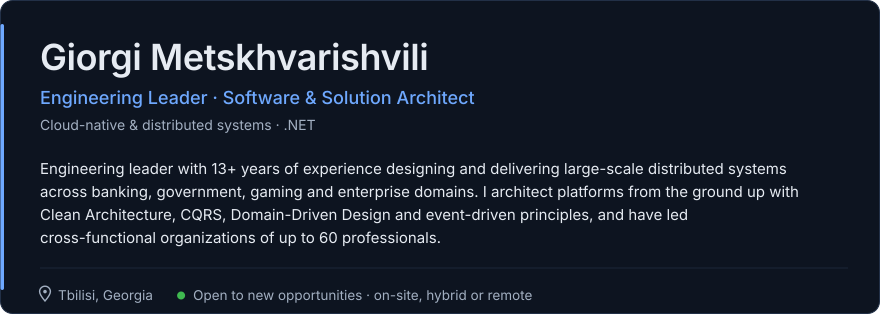

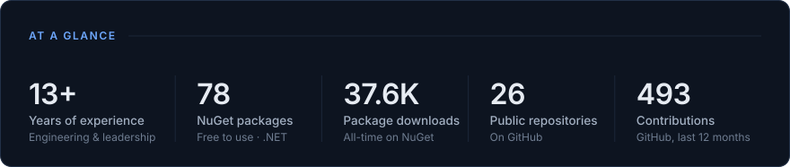
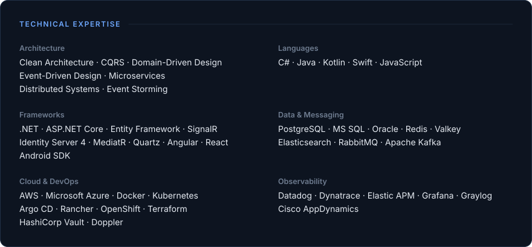
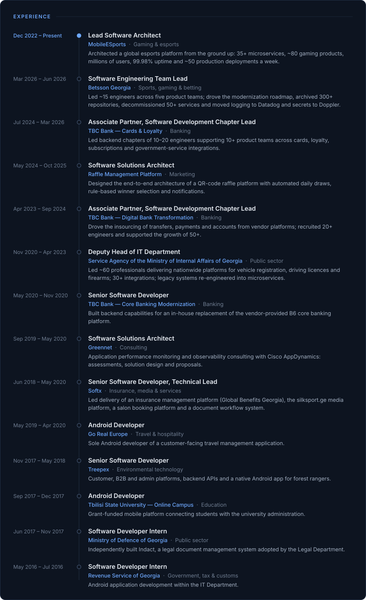

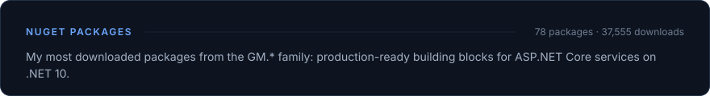
<a href="https://www.nuget.org/packages/GM.Exceptions">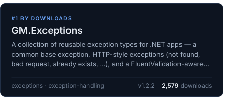</a><a href="https://www.nuget.org/packages/GM.Mediator">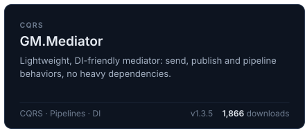</a>
<a href="https://www.nuget.org/packages/GM.EntityFramework.Domain">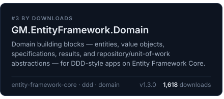</a><a href="https://www.nuget.org/packages/GM.EntityFramework.Persistence">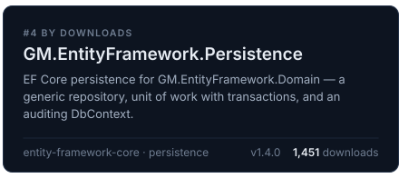</a>
<a href="https://www.nuget.org/packages/GM.Mapper">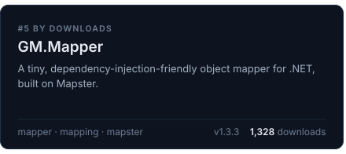</a><a href="https://www.nuget.org/packages/GM.EntityFramework">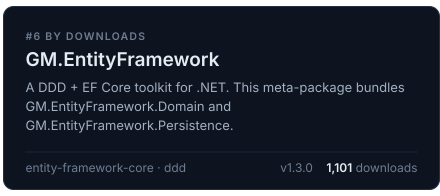</a>
<a href="https://www.nuget.org/packages/GM.API.Application">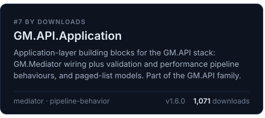</a><a href="https://www.nuget.org/packages/GM.Documentation">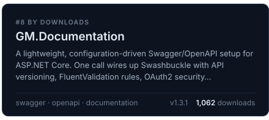</a>

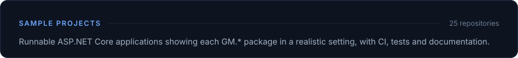
<a href="https://github.com/gmetskhvarishvili/GM.API.Samples">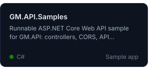</a><a href="https://github.com/gmetskhvarishvili/GM.EntityFramework.Samples">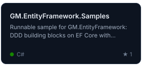</a><a href="https://github.com/gmetskhvarishvili/GM.Exceptions.Samples">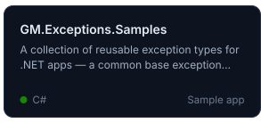</a>
<a href="https://github.com/gmetskhvarishvili/GM.Notifications.Samples">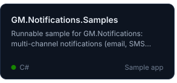</a><a href="https://github.com/gmetskhvarishvili/GM.Messaging.Samples">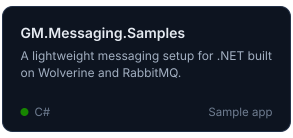</a><a href="https://github.com/gmetskhvarishvili/GM.Mediator.Samples">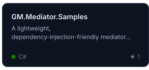</a>
<a href="https://github.com/gmetskhvarishvili/GM.HealthChecks.Samples">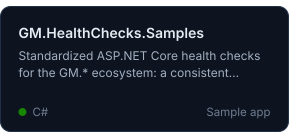</a><a href="https://github.com/gmetskhvarishvili/GM.Testing.Samples">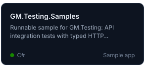</a><a href="https://github.com/gmetskhvarishvili/GM.Documents.Samples">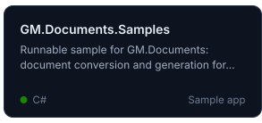</a>
<a href="https://github.com/gmetskhvarishvili/GM.FileStorage.Samples">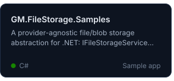</a><a href="https://github.com/gmetskhvarishvili/GM.Mapper.Samples">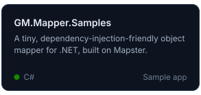</a><a href="https://github.com/gmetskhvarishvili/GM.RealTime.Samples">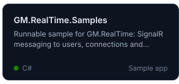</a>
<a href="https://github.com/gmetskhvarishvili/GM.DistributedLock.Samples">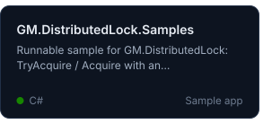</a><a href="https://github.com/gmetskhvarishvili/GM.Documentation.Samples">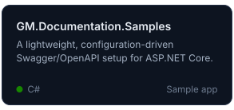</a><a href="https://github.com/gmetskhvarishvili/GM.Caching.Samples">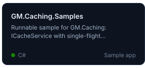</a>
<a href="https://github.com/gmetskhvarishvili/GM.Identity.Samples">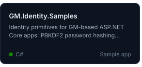</a><a href="https://github.com/gmetskhvarishvili/GM.KYC.Samples">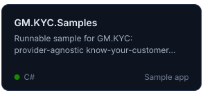</a><a href="https://github.com/gmetskhvarishvili/GM.RateLimiting.Samples">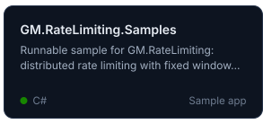</a>
<a href="https://github.com/gmetskhvarishvili/GM.Secrets.Samples">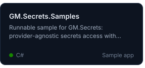</a><a href="https://github.com/gmetskhvarishvili/GM.OTP.Samples">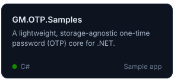</a><a href="https://github.com/gmetskhvarishvili/GM.HttpClient.Samples">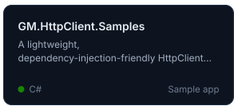</a>
<a href="https://github.com/gmetskhvarishvili/GM.Idempotency.Samples">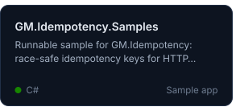</a><a href="https://github.com/gmetskhvarishvili/GM.FeatureManagement.Samples">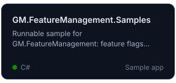</a><a href="https://github.com/gmetskhvarishvili/GM.Gateway.Samples">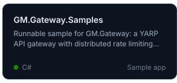</a>

